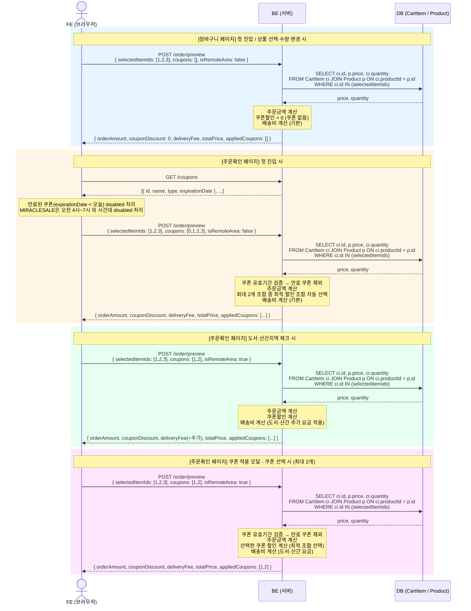

```mermaid
sequenceDiagram
actor FE as FE (브라우저)
participant BE as BE (서버)
participant DB as DB (CartItem / Product)

    %% ─────────────────────────────────────────
    %% 1. 장바구니 페이지 (주문 확인 전)
    %% ─────────────────────────────────────────
    rect rgb(230, 245, 255)
        Note over FE,DB: [장바구니 페이지] 첫 진입 / 상품 선택·수량 변경 시

        FE->>BE: POST /order/preview<br/>{ selectedItemIds: [1,2,3], coupons: [], isRemoteArea: false }

        BE->>DB: SELECT ci.id, p.price, ci.quantity<br/>FROM CartItem ci JOIN Product p ON ci.productId = p.id<br/>WHERE ci.id IN (selectedItemIds)

        DB-->>BE: price, quantity

        Note over BE: 주문금액 계산<br/>쿠폰할인 = 0 (쿠폰 없음)<br/>배송비 계산 (기본)

        BE-->>FE: { orderAmount, couponDiscount: 0, deliveryFee, totalPrice, appliedCoupons: [] }
    end

    %% ─────────────────────────────────────────
    %% 2. 주문확인 페이지 첫 진입
    %% ─────────────────────────────────────────
    rect rgb(255, 245, 230)
        Note over FE,DB: [주문확인 페이지] 첫 진입 시

        FE->>BE: GET /coupons

        BE-->>FE: [{ id, name, type, expirationDate }, ...]

        Note over FE: 만료된 쿠폰(expirationDate < 오늘) disabled 처리<br/>MIRACLESALE은 오전 4시~7시 외 시간대 disabled 처리

        FE->>BE: POST /order/preview<br/>{ selectedItemIds: [1,2,3], coupons: [0,1,2,3], isRemoteArea: false }

        BE->>DB: SELECT ci.id, p.price, ci.quantity<br/>FROM CartItem ci JOIN Product p ON ci.productId = p.id<br/>WHERE ci.id IN (selectedItemIds)

        DB-->>BE: price, quantity

        Note over BE: 쿠폰 유효기간 검증 → 만료 쿠폰 제외<br/>주문금액 계산<br/>최대 2개 조합 중 최적 할인 조합 자동 선택<br/>배송비 계산 (기본)

        BE-->>FE: { orderAmount, couponDiscount, deliveryFee, totalPrice, appliedCoupons: [...] }
    end

    %% ─────────────────────────────────────────
    %% 3. 도서 산간지역 체크
    %% ─────────────────────────────────────────
    rect rgb(230, 255, 240)
        Note over FE,DB: [주문확인 페이지] 도서·산간지역 체크 시

        FE->>BE: POST /order/preview<br/>{ selectedItemIds: [1,2,3], coupons: [1,2], isRemoteArea: true }

        BE->>DB: SELECT ci.id, p.price, ci.quantity<br/>FROM CartItem ci JOIN Product p ON ci.productId = p.id<br/>WHERE ci.id IN (selectedItemIds)

        DB-->>BE: price, quantity

        Note over BE: 주문금액 계산<br/>쿠폰할인 계산<br/>배송비 계산 (도서·산간 추가 요금 적용)

        BE-->>FE: { orderAmount, couponDiscount, deliveryFee(+추가), totalPrice, appliedCoupons: [...] }
    end

    %% ─────────────────────────────────────────
    %% 4. 쿠폰 적용 모달
    %% ─────────────────────────────────────────
    rect rgb(255, 230, 255)
        Note over FE,DB: [주문확인 페이지] 쿠폰 적용 모달 - 쿠폰 선택 시 (최대 2개)

        FE->>BE: POST /order/preview<br/>{ selectedItemIds: [1,2,3], coupons: [1,2], isRemoteArea: true }

        BE->>DB: SELECT ci.id, p.price, ci.quantity<br/>FROM CartItem ci JOIN Product p ON ci.productId = p.id<br/>WHERE ci.id IN (selectedItemIds)

        DB-->>BE: price, quantity

        Note over BE: 쿠폰 유효기간 검증 → 만료 쿠폰 제외<br/>주문금액 계산<br/>선택한 쿠폰 할인 계산 (최적 조합 선택)<br/>배송비 계산 (도서·산간 요금)

        BE-->>FE: { orderAmount, couponDiscount, deliveryFee, totalPrice, appliedCoupons: [1,2] }
    end
```
